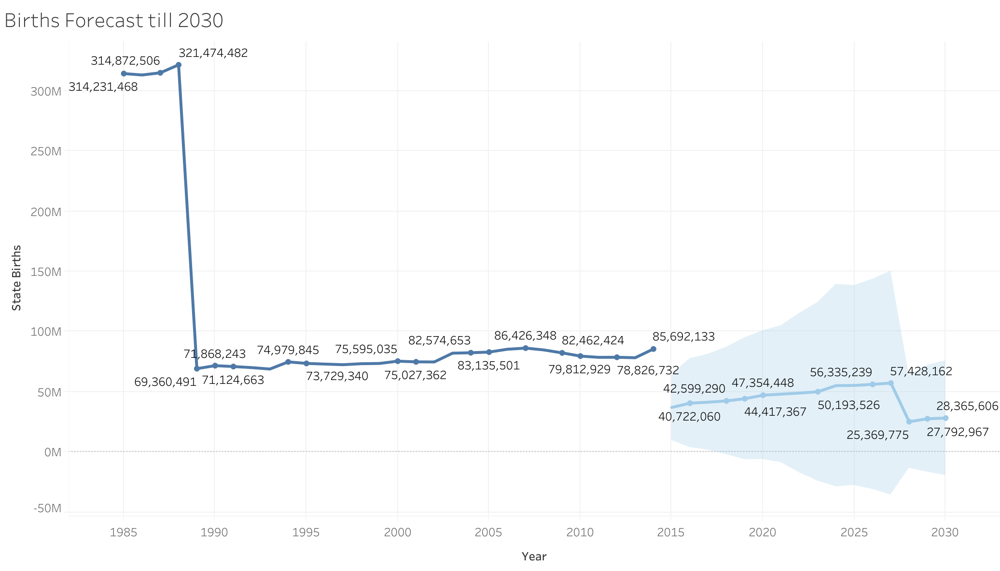

## Portfolio

---

### Births in the USA 1985-2015

Link to [the source](https://github.com/the-pudding/data/tree/master/births){:target="_blank"}

#### Overview
Presented Fields: Year, Month, State Births, County Births, State and County.
Size of dataset: 321475 entries 

#### Data Cleaning and Preprocessing
First thing was to filter the data by state to only the first 50 states, we ended with 313226 entries then map each to its name.
 

#### Visualizations

{:target="_blank"}

---

### Project 2

